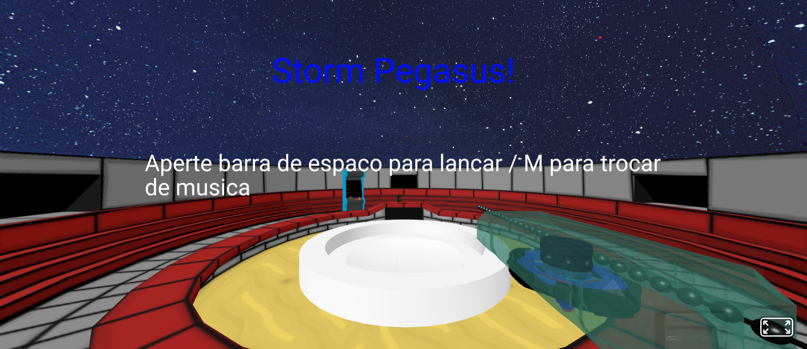
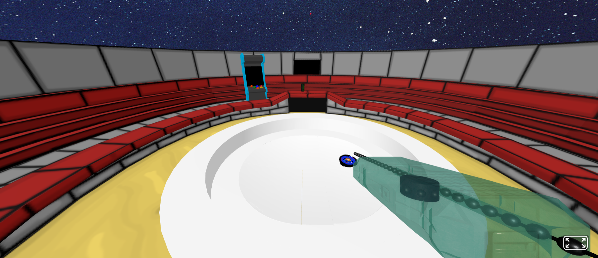
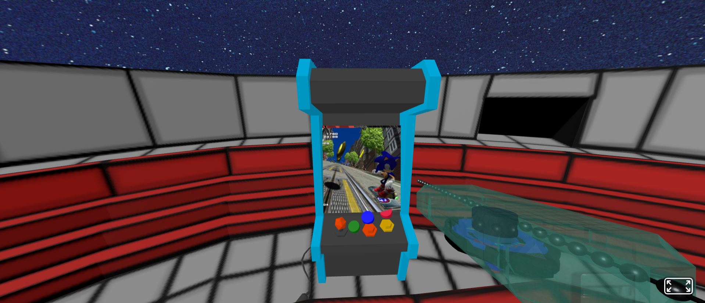

# Atividade VR semana 3
Esta atividade tem como objetivo criar um ambiente em realidade aumentada que proporcione algum tipo de interação do usuário com o cenário. Para este problema foi proposta a criação de uma arena beyblade

<a href="https://imoutofbounds.github.io/augmented-reality-and-VR-experiments/aFrame/">Clique aqui para jogar</a>

Ao iniciar a experiência, o usuário se depara-rá com um tutorial inicial, mostrando os possíveis controles

A primeira interação programada é a de lançar a beyblade, apertando o botão de espaço

Outra interação possível é a de trocar a musica, clicando no botão M, é possível observar uma imagem no arcade proximo a arena beyblade ser
alterada com base na musica atual da cena 
