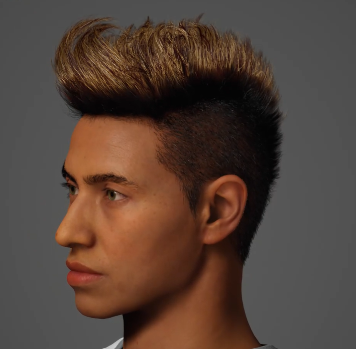

## Menino Ney

- Defina o propósito do humano virtual
O proposito do Menino Ney

- Escolha uma área de aplicação (e.g., educador em RV, personagem para um jogo, assistente virtual em uma loja).

- Elabore uma descrição detalhada do humano virtual:

- Nome, personalidade e função do avatar.

- Cenário de uso prático.

- Justifique a escolha da aparência:

- Explique como a aparência do avatar reflete o contexto escolhido.
O avatar é baseado no jogador de futebol Neymar Jr.

- Considere elementos como idade, gênero, tom de pele, vestuário e expressões faciais.
Idade: 
Gênero: 
Tom de pele: 