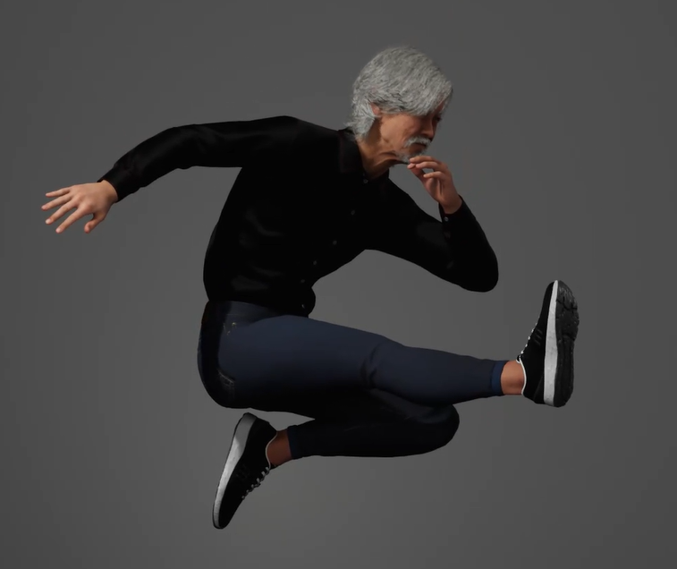
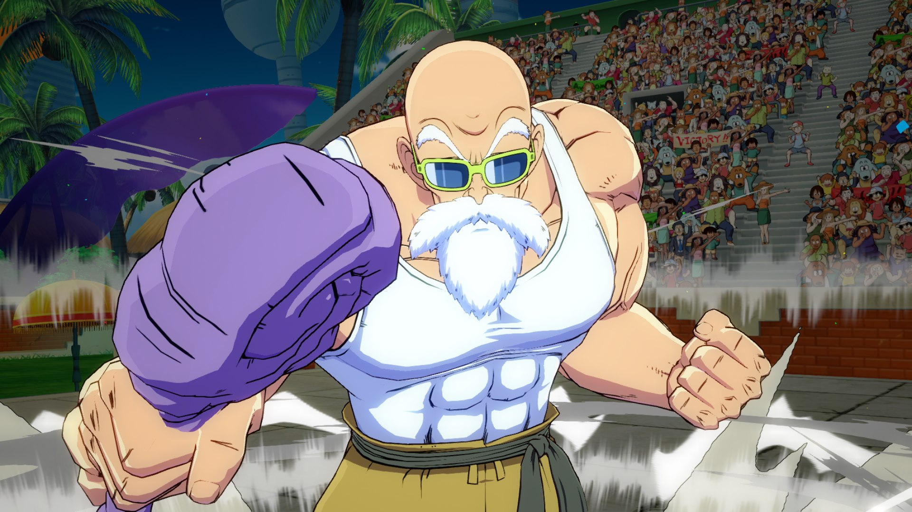
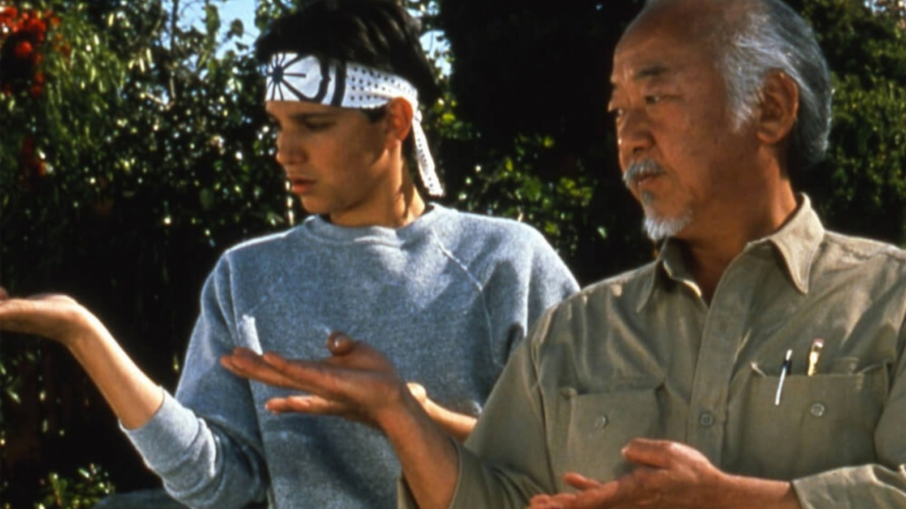
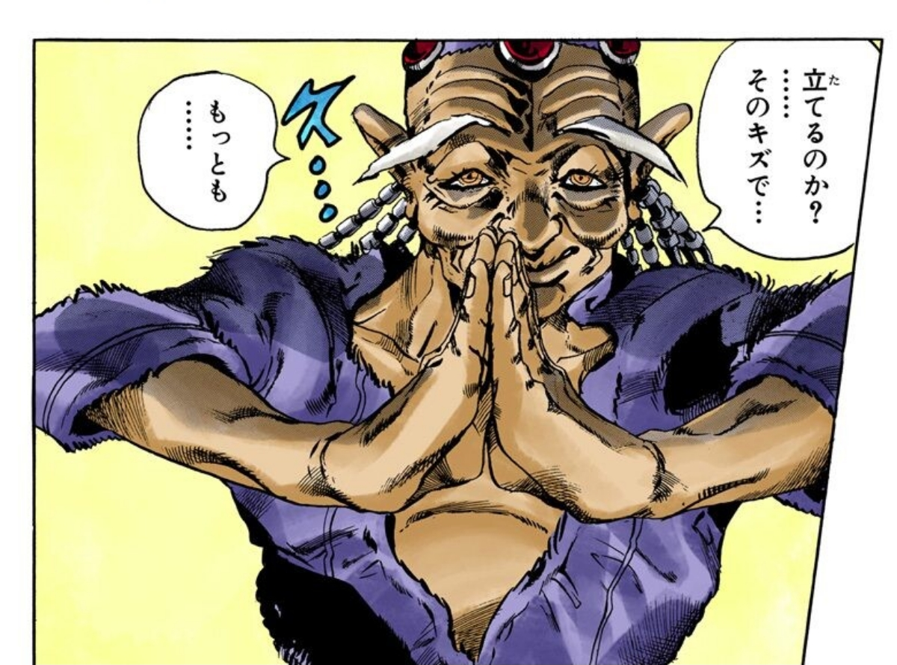
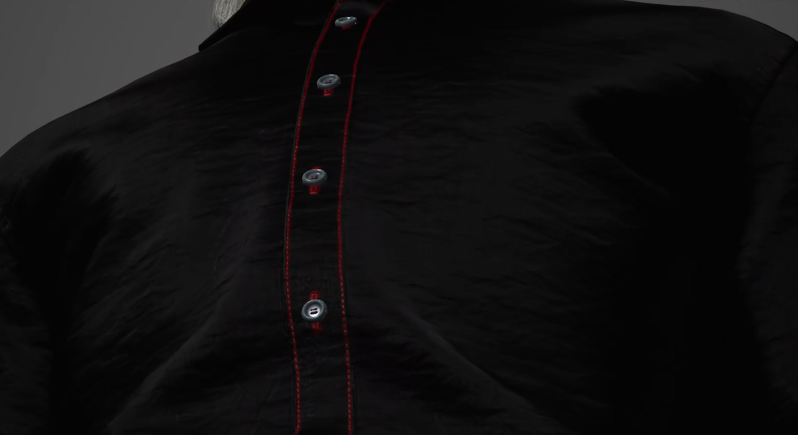
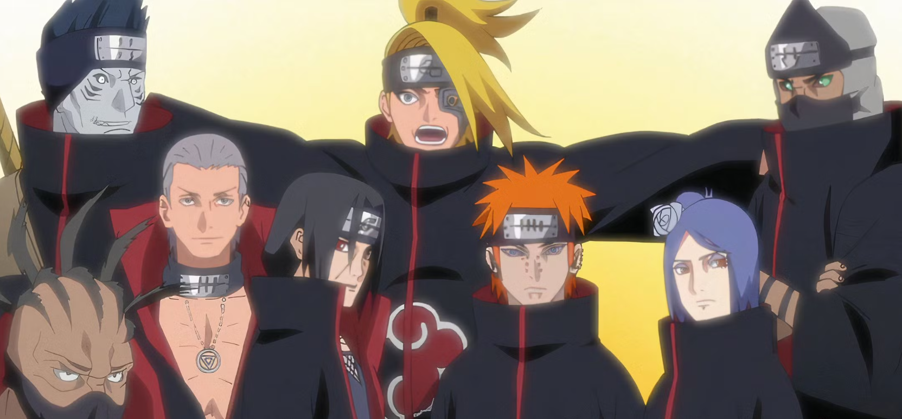

# Atividade de Meta Humanos da semana 2

## Takeshi

### Defina o propósito do humano virtual
proposito do meu Humano virtual é apresentar fatos sobre a cultura dos samurais

### Escolha uma área de aplicação (e.g., educador em RV, personagem para um jogo, assistente virtual em uma loja).
Area da educação, o usuário conseguirá interagir com o personagem, fazendo perguntas sobre a história dos samurais

### Elabore uma descrição detalhada do humano virtual:
O Takeshi é um velho mestre samurai, após passar sua vida toda estudando e treinando para se tornar um guerreiro invencivel, Takeshi tem uma nova ambição, ensinar as novas gerações os princípios e fatos históricos dos samurais.

Sr Takeshi é um senhor japones de 94 anos, que possui um grande conhecimento e experiência na cultura samurai, mantendo sua humildade e sabedoria durante suas aulas

### Nome, personalidade e função do avatar.
- Nome: Sr Takeshi
- Personalidade: Senhor humilde, experiênte e bem humorado
- Função: sua função é ensinar fatos sobre a cultura samurai

### Cenário de uso prático.
- Takeshi pode ser usado em contextos educacionais, ajudando pessoas de qualquer idade a aprender sobre a cultura dos samurais japoneses    

### Justifique a escolha da aparência:
A aparencia do Sr Takeshi é baseada em uma afeição asiática, ele possui cabelos longos e grisálhos, para representar que ele possui uma certa idade
    
### Explique como a aparência do avatar reflete o contexto escolhido.
A aparencia dele é parecida com diversos mestres asíaticos, como:
Mestre Kame de dragonball Z 

Senhor Miyagi de Karatê Kid

Kenzou de Jojo part 6

### Considere elementos como idade, gênero, tom de pele, vestuário e expressões faciais.
- Idade: 94 anos
- Gênero: Maculino
- Tom de pele: Claro
- Vesturário: Roupas mais escuras e comportadas

### Vesturário:
As ropas de takeshi são simples e confortáveis, pois ajudam a ter uma boa movimentação para seus treinos e ao mesmo tempo mantendo um visual discreto

Em sua camisa, podem ser observados alguns detalhes em vermelho, fazendo uma pequena referencia aos mantos da Akatsuki da obra Naruto

### Falas: 
Takeshi: Olá, tudo bem? meu nome é Takeshi, sou um mestre Samurai, a muitos anos estudei e treinei para me tornar um grande guerreiro, e agora procuro novos discipulos para ensinar sobre essa arte, gostaria de saber algo sobre os samurais?

Takeshi: Prazer em conhece-lo jovem, fico feliz em saber que está interessado em aprender as tecnicas samurais. Ser um samurai não é apenas sobre combate, mas também sobre disciplina, honra e equilíbrio.

Takeshi: Quer aprender sobre o Bushidō? Claro! Também conhecido como o caminho do guerreiro, é o guia dos samurais! é o código moral que definia a conduta dos samurais no periodo feudal.