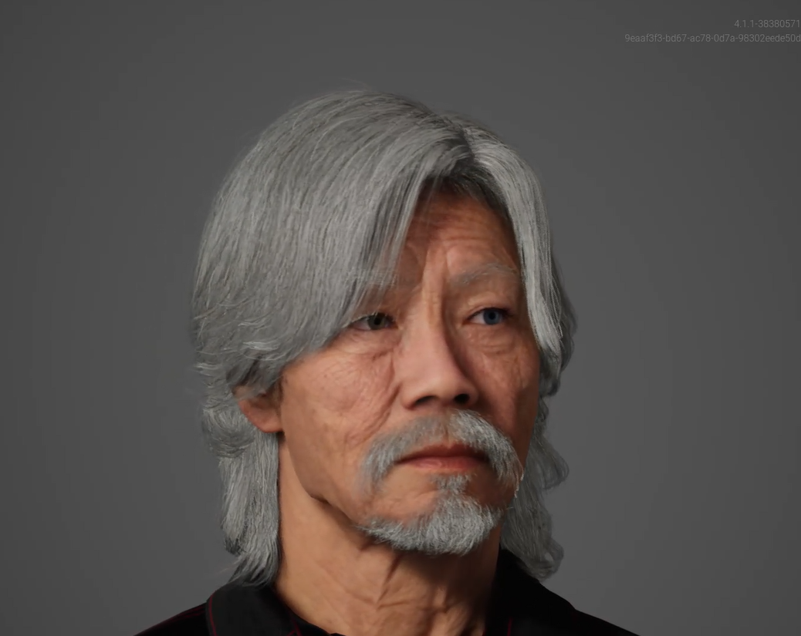
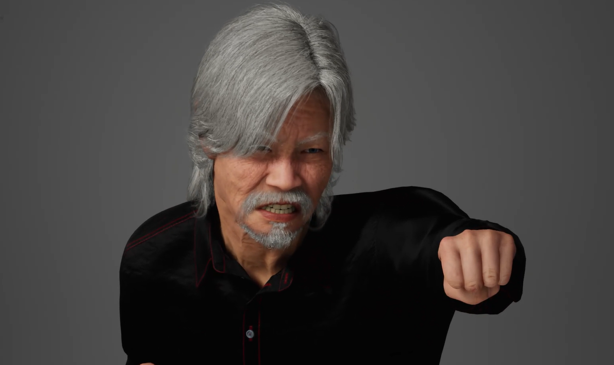

# Atividade de Meta Humanos da semana 2

## Takeshi

### Defina o propósito do humano virtual
Senhor Takeshi é um sabio mestre samurai de 62 anos que foi treinado por um guerreiro cujo lutou na batalha de Shiroyama no ano de 1877, a qual foi a ultima batalha conhecida dos samurais. Seu proposito de vida é ensinar sobre a cultura, filosofia e valores dos samuais japoneses, propagando e mantendo esta cultura para as gerações futuras.

### Escolha uma área de aplicação (e.g., educador em RV, personagem para um jogo, assistente virtual em uma loja).
Educação Interativa aplicada em RV
Takeshi é um 'professor' virtual que conversa e ensina o usuário, guiando o mesmo para uma jornada histórica. 

### Elabore uma descrição detalhada do humano virtual:
Takeshi é um mestre samurai aposentado, com 62 anos. Após uma vida dedicada à arte da espada e à filosofia samurai, ele agora busca passar seus conhecimentos para as novas gerações. Possui uma páz de espírito e energia contagiantes, conseguindo cativar pessoas de todas as idades.
É muito respeitado por todos os que conhecem, mesmo assim mantem sua humildade, pois acredita que todos podem aprender com os ensinamentos dos samurais.

### Nome, personalidade e função do avatar.
- Nome: Sr Takeshi
- Personalidade: Senhor humilde, experiênte e bem humorado
- Função: Educador e mentor

### Cenário de uso prático.
- Takeshi pode ser usado em contextos educacionais, ajudando pessoas de qualquer idade a aprender sobre a cultura dos samurais japoneses    

### Justifique a escolha da aparência:
A aparencia do Sr Takeshi é baseada em uma afeição asiática, ele possui cabelos longos e grisálhos, para representar que ele possui uma certa idade
    
### Explique como a aparência do avatar reflete o contexto escolhido.
A aparencia dele é parecida com diversos mestres asíaticos, como:

#### Mestre Kame de dragonball Z 

Mestre Kame é um sabio mestre do anime Dragon Ball Z, ele foi responsável pela famosa técnica 'Kamehameha', bem como pelo treinamento de personagens como Goku e Kuririn. Embora poderoso, Kame
é lembrado como um personagem divertido, esta característica também pode ser observada em Takeshi.

#### Senhor Miyagi de Karatê Kid

Sr. Miyagi é o mestre da seria Karatê Kid, sempre é retradado como uma pessoa paciênte e sabia, estes trações podem ser observada na abordagem filosófica e pratica na didatica de Takeshi.

#### Kenzou de Jojo part 6

Kenzou é conhecido por conta de seu visual marcante de monge guerreiro. Mesmo sendo um vilão, ele transmite muita habilidade e conhecimento de combate durante sua aparição em Jojo's Bizarre Adventure, e isso 
pode ser observado em Takeshi, por conta de seu visual imponente.

### Considere elementos como idade, gênero, tom de pele, vestuário e expressões faciais.
- Idade: 62 anos
- Gênero: Maculino
- Tom de pele: Claro, possuindo traços característicos asiáticos
- Olhos: Possui heterocromia, tendo seu olho direito cor de castanho mel e esquerdo azul
- Vesturário: Roupas pretas com detalhamento em vermelho, confortáveis e discretas, que permitem boa mobilidade.

### Vesturário:
As ropas de takeshi são simples e confortáveis, pois ajudam a ter uma boa movimentação para seus treinos e ao mesmo tempo mantendo um visual discreto

Em sua camisa, podem ser observados alguns detalhes em vermelho, fazendo uma pequena referencia aos mantos da Akatsuki da obra Naruto

### Falas: 
Takeshi: Olá, tudo bem? meu nome é Takeshi, sou um mestre Samurai, a muitos anos estudei e treinei para me tornar um grande guerreiro, e agora procuro novos discipulos para ensinar sobre essa arte, gostaria de saber algo sobre os samurais?

Takeshi: Prazer em conhece-lo jovem, fico feliz em saber que está interessado em aprender as tecnicas samurais. Ser um samurai não é apenas sobre combate, mas também sobre disciplina, honra e equilíbrio.

Takeshi: Quer aprender sobre o Bushidō? Claro! Também conhecido como o caminho do guerreiro, é o guia dos samurais! é o código moral que definia a conduta dos samurais no periodo feudal.