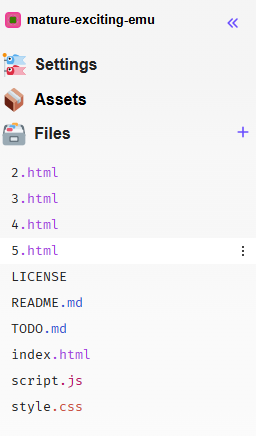
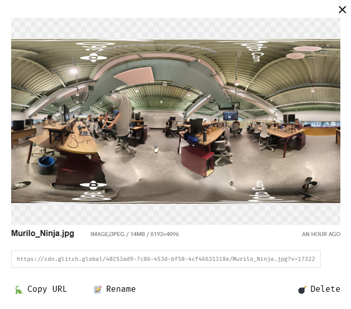

# tour-vr

Projeto de: Leandro de Oliveira Custódio

## Introdução
Este projeto tem como objetivo explorar o uso do Oculos-VR, criando um ambiente interativo que pode ser visualizado pelo site disponilizado por meio do <a href="https://mature-exciting-emu.glitch.me">Glitch</a>.

## Implementação do projeto
Caso deseje, segue abaixo um tutorial com os passos a serem seguidos para criar o projeto:

 - Crie uma conta no <a href="https://glitch.com/">Glich.com</a>
 - Após isso, crie um novo projeto, então organize os arquivos da seguinte forma:

 - Ao clicar em assets, é possível adicionar imagens para serem utilizadas em cada etapa do projeto
 - Para adicionar as imagens como background, clique na imagem que deseja utilizar e então escolha a opção 'Copy URL'

 - Após isso, adicione o link na imagem que contem o id 'imgEscada'

```

```

 - As esferas verdes e vermelhas podem ser editadas alterando as linhas mostradas abaixo:

```
<a-sphere id="vai_para_cima" position="-16 3 -20" radius="0.5" color="#6beb34"></a-sphere>
<a-sphere id="vai_para_baixo" position="-8 1 20" radius="0.5" color="#ed1212"></a-sphere>
```

 - Para alterar destino de cada esfera ao olhar para a mesma, as linhas 39 e 44 do respectivo arquivo devem ser alteradas

```
<script>
    document.querySelector("#vai_para_cima")
      .addEventListener("mouseenter", e => {
        location.href="proximoDestino.html";
      });
    document.querySelector("#vai_para_baixo")
      .addEventListener("mouseenter", e => {
        location.href="destinoAnterior.html";
      });
  </script>
```

## Criar novas imagens
Para criar novas imagens, podem ser utilizados aplicativos como o 360 Photo Cam para a captura de imagens em 360 graus.